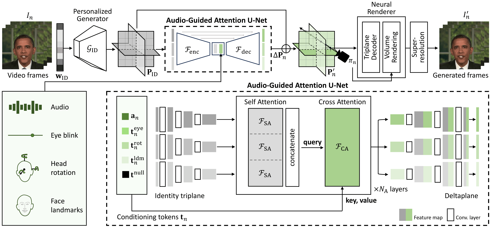

# Talk3D: High-Fidelity Talking Portrait Synthesis via Personalized 3D Generative Prior
<!-- <a href=""></a>
<a href="https://ku-cvlab.github.io/Talk3D/ "></a> -->
<br>

This is our official implementation of the paper 

"Talk3D: High-Fidelity Talking Portrait Synthesis via Personalized 3D Generative Prior"

by [Jaehoon Ko](https://github.com/mlnyang), [Kyusun Cho](https://github.com/kyustorm7), [Joungbin Lee](https://github.com/joungbinlee), [Heeji Yoon](https://github.com/yoon-heez), [Sangmin Lee](https://github.com/00tilinfinity), Sangjun Ahn, [Seungryong Kim](https://cvlab.korea.ac.kr)<sup>&dagger;</sup>

&dagger; : *Corresponding Author*

## Introduction

<!-- <br> -->
We introduce a novel framework (**Talk3D**) for 3D-aware talking head synthesis!

For more information, please check out our [Paper]() and our [Project page](https://ku-cvlab.github.io/Talk3D/).

## Installation
We implemented & tested **Talk3D** with NVIDIA RTX 3090 and A6000 GPU.

Run the below codes for the environment setting. ( details are in requirements.txt )
```
conda create -n talk3d python==3.8
conda activate talk3d
pip install torch==1.12.1+cu116 torchvision==0.13.1+cu116 torchaudio==0.12.1 --extra-index-url https://download.pytorch.org/whl/cu116
pip install absl-py basicsr cachetools clean-fid click cryptography dlib einops facexlib ffmpeg-python fvcore gfpgan h5py imageio imageio-ffmpeg ipykernel joblib keras librosa lmdb lpips matplotlib moviepy mrcfile mtcnn opencv-python pandas Pillow ply pydantic pytorch-fid pytorch-msssim realesrgan requests scipy scikit-learn six soundfile tensorboard tensorflow tqdm wandb yacs trimesh transformers kornia positional-encodings[pytorch] face_alignment
```

## Preparation

Please check `docs/download_models` and follow the steps for preparation.

## Download Dataset

Please check `docs/download_dataset` and follow the steps for preprocessing.

## Dataset Preprocessing

Please check `docs/preprocessing` and follow the steps for preprocessing.

## Training

To train (**Talk3D**), you can use scripts `do_train.sh` after changing some of the configs as:

`--saveroot_path {path/to/save/directory} --data_root_dir {path/to/data/directory} --personal_id {video name}`

For instance, you may edit the script as:

`--saveroot_path {./savepoint} --data_root_dir {./data} --personal_id {May}`

And run the bash script as below:

```
sh do_train.sh
```

## Acknowledgement

We would like to acknowledge the contributions of [EG3D](https://github.com/NVlabs/eg3d) and [VIVE3D](https://github.com/afruehstueck/VIVE3D) for code implementation.

## Citation
If you find our work helpful, please cite our work as:
```

```
